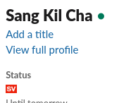
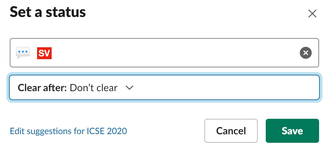

ICSE 2020 Student Volunteer Handbook
===

Thank you for being a Student Volunteer (SV) at ICSE 2020. As you already know,
ICSE 2020 is going virtual for the first time ever. This means, you are going to
be the first virtual SV in the history of ICSE!

The main role of SVs is to run the conference smoothly. You will help
participants get the most out of the conference, and make them happy all through
the conference.

This handbook should provide you with the main information about your duties at
ICSE 2020. If you have any questions or suggestions, please feel free to create
a PR (Pull Request). We will do our best to update this document up to date.

# Table of Contents

- [ICSE 2020 Student Volunteer Handbook](#icse-2020-student-volunteer-handbook)
- [Table of Contents](#table-of-contents)
  - [Understanding Virtual ICSE](#understanding-virtual-icse)
  - [ICSE Live! Team](#icse-live-team)
  - [SV Shift Plan](#sv-shift-plan)
  - [Schedule and Assignments](#schedule-and-assignments)
  - [SV Types](#sv-types)
  - [SV Chairs](#sv-chairs)
  - [Slack for All Communication](#slack-for-all-communication)
    - [Slack Channels](#slack-channels)
    - [Slack Profile](#slack-profile)
    - [Slack Display Name](#slack-display-name)
  - [Description of SV Tasks](#description-of-sv-tasks)
    - [Online SV](#online-sv)
      - [Helping Live Casting](#helping-live-casting)
      - [Managing 24-hour Help Desk](#managing-24-hour-help-desk)
      - [Using Social Media](#using-social-media)
    - [Offline SV](#offline-sv)
    - [CLE SV](#cle-sv)
  - [Example Scenario](#example-scenario)
  - [FAQs](#faqs)

## Understanding Virtual ICSE

The whole conference runs by three (plus one for China) independent teams in
three different time bands. The three time bands are the Pacific, Indian
(Asian), and Atlantic time band, which will cover `00:00 - 03:00`, `07:00 -
10:00`, and `15:00 - 18:00` in UTC. For more detailed information, please visit
the main [ICSE web site](https://conf.researchr.org/home/icse-2020).

Each team will take care of three-hour-long sessions per day. Specifically, each
team will handle regular sessions for two hours, and smaller event sessions,
such as poster and demo sessions, for one hour.

## ICSE Live! Team

The conference will be live-cast to youtube (and to iQIYI for Chineses friends),
and there are four dedicated teams that we call ["ICSE Live!
Team"](https://2020.icse-conferences.org/committee/icse-2020-virtualization-regional-live--team-leaders)
for each time band (plus China). Please note that live broadcasting should be
done by the ICSE Live! Team, but not by SVs. The role of SVs should not be
confused with the ones of Live! Team.

To understand how the ICSE Live! Teams operate, see
[this](https://github.com/crista/icse2020-live).

## SV Shift Plan

We run three shifts for 24 hours, 8-hour each.

- Pacific time shift: 22:00 - 6:00 UTC
    - This includes the Pacific time band (00:00 - 03:00 UTC)
    - SVs here will work with the Pacific team.
- Indian time shift: 06:00 - 14:00 UTC
    - This includes the Indian time band (07:00 - 10:00 UTC)
    - SVs here will work with the Indian team.
- Atlantic time shift: 14:00 - 22:00 UTC
    - This includes the Atlantic time band (15:00 - 18:00 UTC)
    - SVs here will work with the Atlantic team.

## Schedule and Assignments

|       	| Pacific time shift                                                                                                                  	| Indian time shift                                                                                                         	| Atlantic time shift                                                                                                                                  	|
|-------	|-------------------------------------------------------------------------------------------------------------------------------------	|---------------------------------------------------------------------------------------------------------------------------	|------------------------------------------------------------------------------------------------------------------------------------------------------	|
| **July 7** 	| Nischal Shrestha Lingjun Liu Haemin Ryu Nianyu Li Soumik Mohian Zhiqiang Wu                                          	| Benny Chun Gichan Lee Jiho Shin Jaeseung Choi Mahyar Tourchi Moghaddam Rusen Halepmollasi                  	| Armstrong Foundjem Akalanka Galappaththi Anderson Jose Silva de Oliveira Anderson Uchôa Camilo Escobar-Velásquez Cristiano Politowski 	|
| **July 8** 	| Nischal Shrestha Lingjun Liu Haemin Ryu Shivani Shirolkar Soumik Mohian Zhiqiang Wu                                  	| Nilesh Meshram Qurat ul ain Ali Hyerin Leem Tobias Schwarz Sorour Jahanbin Shiwei Feng                     	| Armstrong Foundjem Akalanka Galappaththi Anderson Jose Silva de Oliveira Anderson Uchôa Camilo Escobar-Velásquez Cristiano Politowski 	|
| **July 9** 	| Daye Nam Caio Barbosa Vieira da Silva Mohammad Abdul Hadi Harsha Perera Huilian Sophie Muhammad Umair Khan           	| Gebrehiwet Biyane Welearegai Alfredo Ibias Benny Chun Gichan Lee Glaucia Melo Jiho Shin                    	| Cristiano Politowski David A Nader Palacio Dewi Yokelson Denivan Campos Daniel Tenorio Martins de Oliveira Eduardo Fernandes          	|
| **July 10** 	| Sohil Lal Shrestha Caio Barbosa Vieira da Silva Mohammad Abdul Hadi Harsha Perera Huilian Sophie Muhammad Umair Khan 	| Jaeseung Choi Nilesh Meshram Qurat ul ain Ali Christoph Matthies Sorour Jahanbin Shiwei Feng               	| Cristiano Politowski David A Nader Palacio Dewi Yokelson Denivan Campos Daniel Tenorio Martins de Oliveira Eduardo Fernandes          	|
| **July 11** 	| Ananga Thapaliya Ahmad Abdellatif Nianyu Li Rishab Sharma Shivani Shirolkar Xin Chen                                 	| Alfredo Ibias Glaucia Melo Minxing Tang Gebrehiwet Biyane Welearegai Rusen Halepmollasi Christoph Matthies 	| Elson Kurian Iván Arcuschin Moreno Zhenhao Li Luana Martins Luiz Carvalho Nathan Cooper                                               	|

- Co-located Events (CLEs)
  - AST: Renan Greca
  - MSR: Chua Kiat Kian Anthony and 신승철
  - FormaliSE: Doyeon Kim
- Offline SVs
  - Ana Carla Gomes Bibiano
  - Agustín E. Martinez Suñé
  - Miller Andrés Trujillo Achury
  - Nan Yang
  - Radu Prekup
  - Sadura Akinrinwa
  - Sarah Fakhoury
  - Saulo Soares de Toledo
  - Shayan Zamani
  - Xianhao Jin

## SV Types

Unlike traditional conferences, we divide SVs into three groups: online SVs,
offline SVs, and CLE SVs.

- *Online SVs* work closely with a regional [ICSE Live!
  team](#icse-live-team). Online SVs will work in one of the three
  [shifts](#sv-shift-plan). We will assign Online SVs based on which time band
  they belong to. For example, SVs in the Pacific time band will work with the
  Pacific team.

- *Offline SVs* work asynchronously to help edit videos, and upload videos to
  either youtube or iQIYI. Therefore, offline SVs do not need to be bound to a
  specific time zone.

- *CLE SVs* support CLEs (Co-Located Events), and their work is largely similar
  to those of online SVs.

## SV Chairs

SV chairs lead the overall organization of SVs and interface with the general
chair and live teams. Contact the SV chair in your time band whenever necessary.

- Pacific Time Band: [Sang Kil Cha](https://softsec.kaist.ac.kr/~sangkilc/)
- Indian (Asian) Time Band: [José Miguel Rojas](http://jmrojas.github.io/)
- Atlantic Time Band: [Hamid Bagheri](https://cse.unl.edu/~hbagheri/)

## Slack for All Communication

It is absolutely critical that we communicate effectively and continuously
during the conference. We will be using Slack fo all communication between
SVs.

### Slack Channels

Please join the following channels ASAP.

- `#sv-general` is the main form of communication.
- `#sv-pacific` is for online SVs in the Pacific shift.
- `#sv-indian` is for online SVs in the Indian shift.
- `#sv-atlantic` is for online SVs in the Atlantic shift.
- `#sv-offline` is for offline SVs.
- `#sv-cles` is for CLE SVs.

### Slack Profile

Please set your name correctly, and register your photo.

### Slack Display Name

To indicate you are an SV, you have to change your Slack status with the SV icon
(`:sv:`). For example, see the image below:

.

Please make sure to select "don't clear" when you set your status:

.

## Description of SV Tasks

Both online and offline SVs have their own expected tasks.

### Online SV

#### Helping Live Casting

- Make sure all the speakers are connected before a session start.
- Keep track of the time and let the session chair know (via Slack) if a talk
  goes too long.
- Arrange questions from Slack and Slido and give them to the session chair.
- Check if all the attendees are registered (check free riders).

#### Managing 24-hour Help Desk

We manage a virtual help desk, which runs for 24 hours through the [three
shifts](#sv-shift-plan):

- Pacific time shift: 22:00 - 6:00 UTC
- Indian time shift: 06:00 - 14:00 UTC
- Atlantic time shift: 14:00 - 22:00 UTC

SVs should handle questions and troubleshoot frequently occuring problems (such
as audio/video issues) with speakers and participants.

#### Using Social Media

SVs should also advertise talks on social media whenever it is possible. You can
use your personal account, or create a new one just for ICSE.

The main conference hashtag is `#icse2020`.

### Offline SV

Offline SVs work offline to help edit and upload videos to youtube. Therefore
offline SVs are not bound to any specific time band.

### CLE SV

CLE SVs support co-located conferences, such as MSR, FormaliSE, etc. Therefore,
their work time largely depends on the schedule of CLEs they support. The main
tasks of CLE SVs will be mostly the same as the ones of [online SVs](#online-sv):
their main job is to help session chairs to organize questions, etc.

## Example Scenario

This example shows how each SV will do during an 8-hour-long shift. We assume
there are 6 SVs (SV0, SV1, ..., SV5) working concurrently during the shift.

- `T0`: 1 hour before casting
    * All the SVs (SV0, ..., SV5)
        - Join the `#help` channel of Slack, and handle questions.
        - Join the virtual room (channel) of Slack that you are assigned to.
        - Know the names of your session chairs.

- `T1`: Live casting starts
    * SV0, SV1, SV2 (one SV per each parallel session)
        - Clean up Slido questions before each talk begins.
        - Monitor both Slack and Slido, and check if there is any question from
          Slack, which is not added to Slido. If so, add it to Slido.
        - Clean up Slido questions whenever they are answered by the speaker.
        - Monitor the time of each talk and let the session chair know if the
          talk goes too long.
    * SV3, SV4, SV5
        - Take questions from the `#help` channel.
        - If necessary, you will make an individual connection with a person and
          troubleshoot their problems (mostly audio/video issues).
        - If you have spare time, then advertise talks on social media.

- `T2`: Live casting runs (same as T1)

- `T3`: Live casting runs (same as T1)

- `T4`: No live casting
    * One SV (e.g., SV0) will take care of the `#help` channel from now on until
      the end of T7.

- `T5`: No live casting (same as T4)
- `T6`: No live casting (same as T4)
- `T7`: No live casting (same as T4)

## FAQs

- When do my duties finish?
    - We expect you to be available during your shift (i.e., for 8 hours). If
      your main role is end, then we will assign you something else. Please
      remain online in Slack.

- (TODO: FILL ME)
